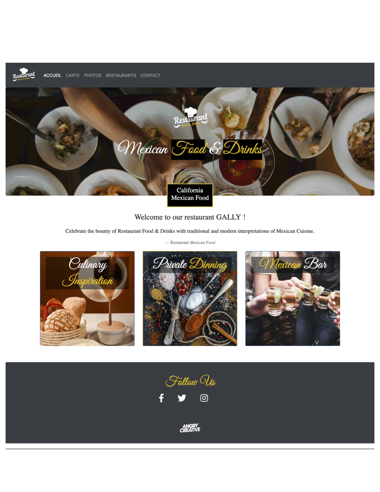
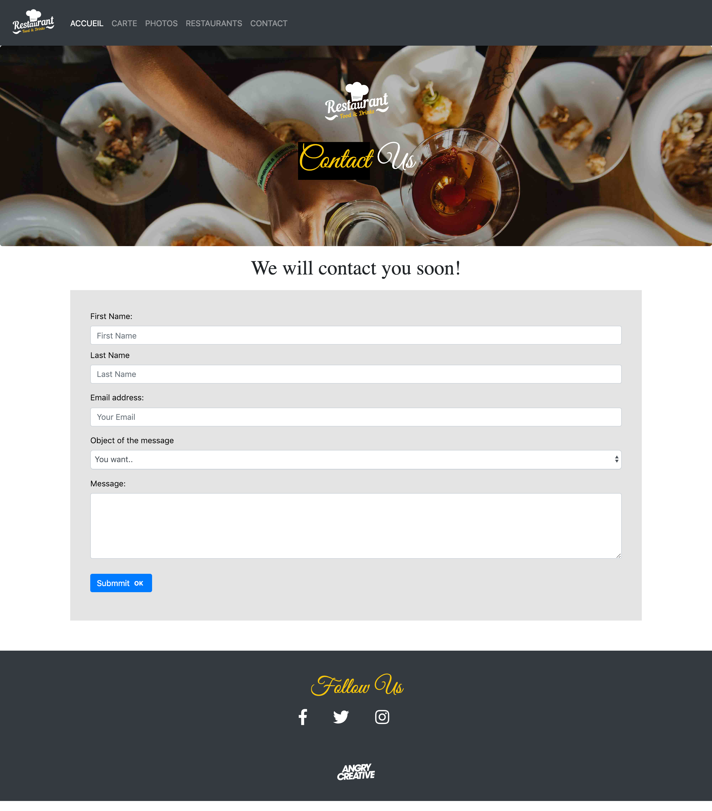

# Projet : Premier site en Bootstrap

**GithubPage** : [The Restaurant](https://meilyn.github.io/bootstrap-resto-website/)

[**Meilyn ANDRADE**](https://meilyn.github.io/)

**Where**: BeCode [Junior Web Developper]

**When**: February 2019 

**DeadLine** : Jeudi 21/02/2019 à 17:00

**Status**: In progress

## Technologies Utilisées pour cet projet

* HTML & CSS
* Bootstrap [Framework]
* Javascript
* PWA (Progressive Web Application)
* Service Worker

## Cahier des charges

**Le site est un site vitrine d'une franchise :** 

* Burguers
* Pizza
* Chinesse

**Le site doit être responsive** : au moins pour les petits écrans (xs) et les écrans moyens (md)

Minimum 5 pages accessibles par une barre de navigation (navbar) présente sur toutes les pages vers les différentes rubriques :
 
* Accueil 
* Carte 
* Photos 
* Restaurants 
* Contact

## Consignes
- Un fichier CSS pour tout le site (en plus de celui de Bootstrap, bien sûr. Contraintes : vous utiliserez le CDN.)
- Liens relatifs aux autres pages (pas de liens absolus)
- Fichiers rangés dans des dossiers (assets, puis css, js et img dedans)
- Utilisation de Font Awesome
- Le site doit être intégralement responsive.
- GitHub : le lien de la page GitHubPage se trouve à côté de la description (donc il faut une description au repo) ET on veut un readme
- N'oubliez pas le favicon
- Utilisez des images libre de droits (vous pouvez en trouver sur pexels, pixabay, unsplash,...)
- Lighthouse : 80% sur toutes les catégories (pour les PWA, il y a un nouveau repo avec les instructions).

### Composition du website

- Une page **Accueil** avec un composant Jumbotron avec le logo ou le nom du restaurant qui s'anime comme dans votre précédent projet MainEventer.

- Une page **Carte** avec les menus présentés sous forme de liste groupée avec badges.

- Une page **Photos** avec une galerie photos (minimum 10). On veut 4 photos sur chaque ligne en format Desktop, 2 en format Tablet et 1 en format smartphone.

- Une page **Restaurants** avec l'adresse, un plan d'accès et les heures d'ouverture d’au moins trois restaurants (c’est une franchise !)

- Une page **Contact** avec un formulaire de contact comprenant nom, prénom, e-mail, liste déroulante (objet du message avec un select et des options)), un champs de texte (pour le message), un bouton d'envoi avec glyphicon. Mettre un label également sur cette page pour indiquer un truc.

### Désirs du client

- Le client souhaite qu'à l'ouverture de la page d'accueil, il y ait un pop-up qui récupère le prénom du visiteur, puis affiche un "bonjour {nom du visiteur} !" avant le texte de présentation du restaurant.

- Le client souhaite que dans la partie Restaurants, en plus de l'affichage des horaires et des jours d'ouverture, il y ait une mention interactive "Nous sommes le { date et heure }, le restaurant est donc { ouvert / fermé }" en fonction de l'heure et la date de consultation du site.

## Difficultés 
Le temps! Le temps! C'était la prémier fois que je me consacré 4 jours à travailler avec cette framework. J'étais un peu perdue au début. J'ai recontre des difficultes quand je sens que je vais très vite et que je connais pas la technologie (I'm afraid). Mais, je suis persistante et j'arrivée à finir.

La PWA m'as mit du temps a comphrendre. Merci @Joseph_ismail pour tes explications 

### Maquette
## Accueil

## Menu

## Gallery

## Restaurants

## Contact
